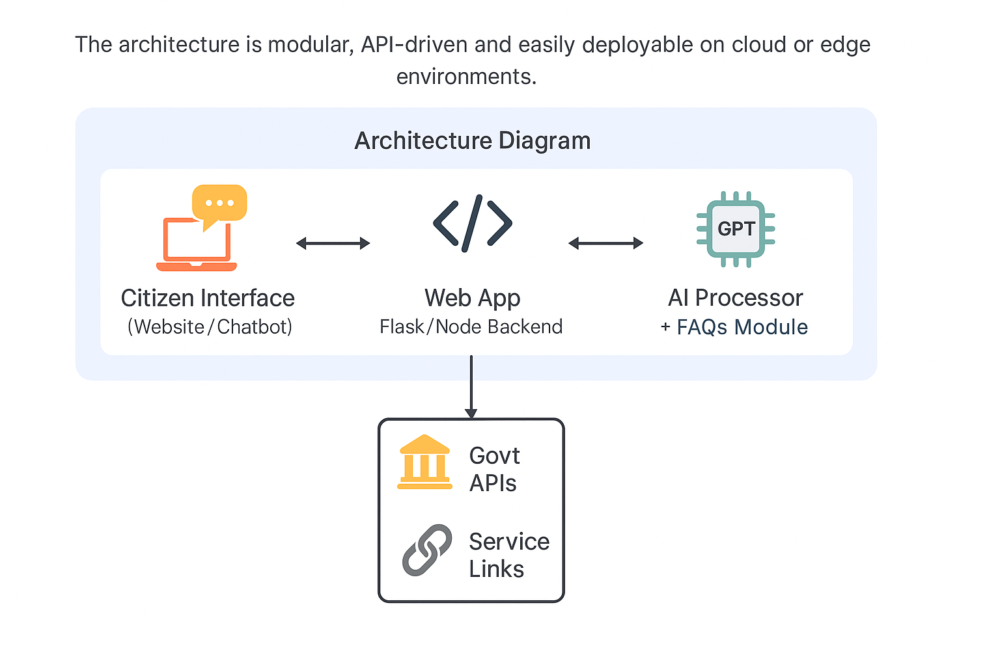

# 🧠 Citizen AI Assistant (Bot)

**Your Smart Assistant for Public Services & Government Portals**

---

## 🚀 Project Overview

**Citizen AI Bot** is a powerful conversational interface architected to bridge the gap between Indian citizens and essential government services.
It uses intelligent natural language understanding with structured domain expertise to offer accurate, timely, and personalized assistance.

### 🎯 Core Capabilities

* ✅ Real-time query resolution for **Aadhaar**, **PAN**, **Passport**, **Voter ID**, and **Income Tax Filing**
* 🔗 Smart routing to trusted government portals for application tracking, downloads, and authentication
* 🔐 **Secure and transparent**: Ethical response models and verifiable links for user trust

---

## 📡 Live Demo
<a href="https://citizen-ai-assistant.netlify.app/" target="_blank" rel="noopener noreferrer">🚀 Launch Citizen AI Assistant (Live Demo)</a>

---

## 💡 Use Case

Citizens often face delays or confusion while navigating government websites or processes. The Citizen AI Bot:

* Reduces dependency on manual service centers
* Assists users 24x7 in simple conversational language
* Handles FAQs for Aadhaar, PAN, Passport, Voter ID, and Income Tax
* Can be integrated into government websites, apps, and kiosks
* Reduces workload on human helplines

---

## 🧱 System Architecture

The architecture is modular, API-driven, and easily deployable on cloud or edge environments.

---

## 🛠 Technologies Used

* **Frontend:** HTML5, CSS3, JavaScript, Material Design
* **Backend:** Python Flask or Node.js Express (optional), **AWS Bedrock** for secure model hosting and orchestration
* **AI Engine:** OpenAI GPT APIs for natural language responses
* **Deployment:** Cloud (AWS/GCP) or local servers
* **Icons & Fonts:** Font Awesome, Google Fonts

---

## 🆔 Aadhaar Card FAQs

*Covers identity updates, document requirements, download & reprint help, and application status checks.*

1. How can I check the status of my Aadhaar application?
2. I want to update my address on my Aadhaar. What should I do?
3. Can I change my phone number linked with Aadhaar?
4. Where can I download a reprint of my Aadhaar card?
5. My Aadhaar has an error in my name. How do I fix it?
6. Is there a fee to update Aadhaar details?
7. How long does it take to get an Aadhaar card after enrollment?
8. Can I update Aadhaar details online or do I have to visit a center?
9. What documents are needed to update my Aadhaar information?
10. My Aadhaar card is lost. How do I get a duplicate copy?

---

## 💳 PAN Card FAQs

*Application, correction, linking with Aadhaar, and tracking PAN status.*

1. How can I apply for a new PAN card?
2. Where can I check the status of my PAN application?
3. I need to correct my name on my PAN card. How to do that?
4. Is it possible to link my PAN card with Aadhaar online?
5. What is the fee for applying for a new PAN card?
6. Can I apply for a PAN card using my Aadhaar?
7. How do I download an e-PAN card?
8. My PAN card is lost. How can I get a reprint?
9. How many days does it take to get a PAN card delivered?
10. Can I apply for a PAN card without a digital signature?

---

## 🛂 Passport Services FAQs

*Application, renewal, verification, and police clearance processes.*

1. How do I apply for a new passport in India?
2. What documents are needed to apply for a passport?
3. How can I track my passport application status?
4. Can I renew my expired passport online?
5. What is the fee for passport application or renewal?
6. How do I schedule an appointment for passport verification?
7. Can I reschedule my passport appointment?
8. How long does it take to get a passport delivered?
9. Do I need police verification for passport renewal?
10. How can I update my address on my passport?

---

## 🗳 Voter ID (EPIC) FAQs

*Voter registration, address/name correction, and electoral roll checking.*

1. How can I apply for a new voter ID online?
2. Where do I check if my name is in the electoral roll?
3. Can I update my address in the voter ID?
4. My voter ID has a wrong name. How do I correct it?
5. What documents are required to apply for a voter ID?
6. How do I check the status of my voter ID application?
7. Can I apply for a voter ID without an Aadhaar card?
8. How can I download an e-voter ID card?
9. I moved to a new city. How do I transfer my voter ID?
10. What is the helpline for voter ID-related queries?

---

## 💼 Income Tax Filing (ITR) FAQs

*Tax filing, refund status, e-verification, and deadlines.*

1. How do I file income tax returns online?
2. What is the last date for ITR filing this year?
3. How can I check the status of my ITR refund?
4. How do I link my Aadhaar with PAN for ITR?
5. Do I need to file ITR if my income is below 5 lakhs?
6. How to e-verify my income tax return after filing?
7. Can I revise my income tax return after submitting it?
8. Where can I find Form 16 for tax filing?
9. How do I know which ITR form to use?
10. What is the penalty for late ITR filing?

---

## 🙌 Credits

* **Developed by:** DADULU SHAIK
* **Powered by:** OpenAI GPT APIs
* **Cloud Backend:** AWS Bedrock

### © 2025 Citizen AI Assistant — All rights reserved.

